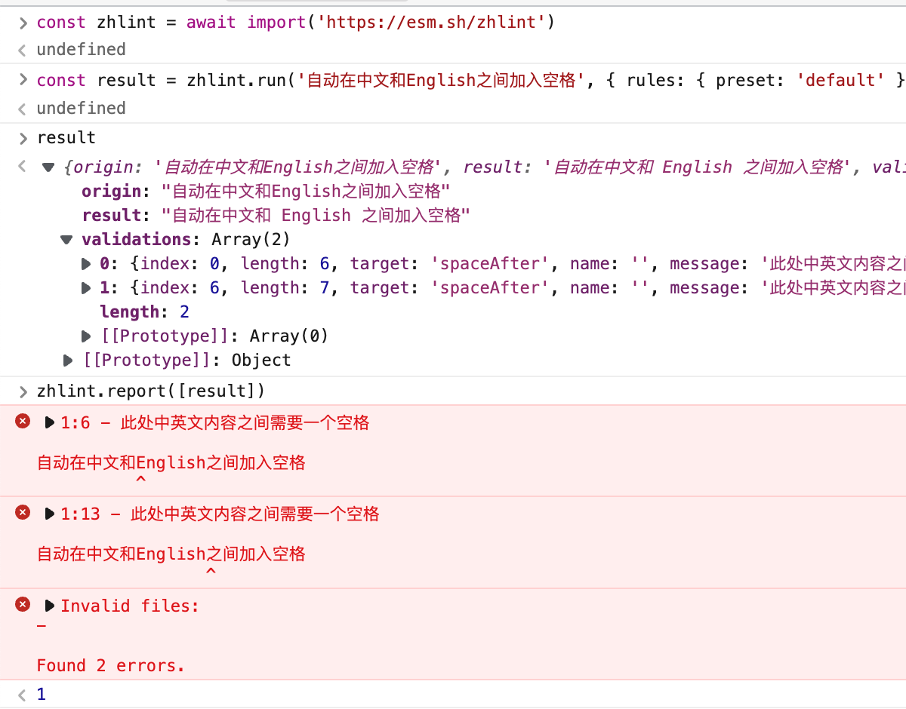

#  zhlint

一个中文内容的格式化工具。

## 如何安装

您可以通过 `npm` 或 `yarn` 安装 `zhlint`：

```bash
# 通过 npm 安装
npm install zhlint -g

# 或通过 yarn
yarn global add zhlint
```

## 用法

### 作为 CLI

```bash
# Glob 文件，执行格式化命令，并打印错误报告，
# 如果有任何错误被发现，则会以错误码 `1` 退出。
zhlint <file-pattern>

# Glob 文件，并修复所有可能发现的错误。
zhlint <file-pattern> --fix

# 格式化文件并将修复后的内容输出到另一个文件。
zhlint <input-file-path> --output=<output-file-path>

# 打印用法信息
zhlint --help
```

错误报告看起来像这样：


### 作为 Node.js 包

```js
const { run, report } = require('zhlint')

const value = '自动在中文和English之间加入空格'
const output = run(value)

// 打印 '自动在中文和 English 之间加入空格'
console.log(output.result)

// 打印错误报告
report([output])
```

错误报告的格式像这样：

```bash
1:6 - There should be a space between a half-width content and a full-width content

自动在中文和English之间加入空格
           ^
1:13 - There should be a space between a half-width content and a full-width content

自动在中文和English之间加入空格
                  ^
Invalid files:
- foo.md

Found 2 errors.
```

### 作为一个单独的包

您可以找到一个 JavaScript 文件 `dist/zhlint.js` 作为独立版本。 例如，要使用它，您可以直接将它添加到您的浏览器中作为 `<script>` 标签。 即可访问全局变量 `zhlint`。



#### API

- `run(str: string, options?: Options): Result`：格式化某个文件。
  - 参数：
    - `str`：需要格式化的文本内容。
    - `options`：高阶选项。
  - 返回值：
    - 针对输入的单个字符串的处理结果。其包好了修复格式之后的文本内容 `value` 以及所有 `validation` 的校验信息。
- `report(results: Result[], logger?: Console): void`：为每个文件打印校验报告。
  - 参数：
    - `results`：所有格式化结果的数组。
    - `logger`：日志处理器实例，默认是 Node.js/浏览器中的 `console`。

#### 其它类型定义和高阶用法

- `Result`：`{ file?: string, origin: string, result: string, validations: Validation[] }`
  - `file`：文件名。这是一个可选的字段，只在 CLI 中适用。
  - `origin`：原始的文本内容。
  - `result`：最终修复格式的文本内容。
  - `validations`：所有校验信息。
- `Validation`：`{ index: number, length: number, name: string, target: string, message: string }`
  - `index`：输入的字符串中目标片段所在的索引值。
  - `length`：输入的字符串中目标片段的长度。
    <!-- - `name`: The name of the rule that the token disobeys to. -->
    <!-- - `target`: The target part of the target token, like the `content` or the `spaceAfter` that, etc. -->
  - `message`：对该校验信息的自然语言描述。
- `Options`：`{ rules?: string[], hyperParse?: string[], ignoredCases?: IgnoredCase[], logger?: Console }`：自定义你的规则和其它高阶选项。
  - `rules`：根据规则名自定义格式化规则列表，可以是 `undefined` 以使用默认[规则列表](https://github.com/Jinjiang/zhlint/tree/master/src/rules)。
  - `hyperParse`：根据解析器名自定义超文本解析器列表，可以是 `undefined` 以使用默认的[忽略特例的解析器](https://github.com/Jinjiang/zhlint/tree/master/src/parsers/ignore.js)、[Markdown 解析器](https://github.com/Jinjiang/zhlint/tree/master/src/parsers/md.js)以及[Hexo tag 解析器](https://github.com/Jinjiang/zhlint/tree/master/src/parsers/hexo.js)。
  - `ignoredCases`：提供想要忽略的特例。
  - `logger`：和 `report(...)` 中的参数相同。
- `IgnoredCase`：`{ prefix?, textStart, textEnd?, suffix? }`
  - 遵循该特定的格式，灵感来自 [W3C Scroll To Text Fragment Proposal](https://github.com/WICG/ScrollToTextFragment)。

## 特性

### Markdown 语法支持

```js
run('自动在_中文_和**English**之间加入空格')
```

### [Hexo tag](https://hexo.io/docs/tag-plugins) 语法支持

```js
run('现在过滤器只能用在插入文本中 (`{{ }}` tags)。')
```

### 设置被忽略的特例

通过 HTML 注释：

```md
<!-- the good case -->

text before (text inside) text after

<!-- the bad case -->

vm.$on( event, callback )

<!-- 我们可以在这里写下要忽略的特例 -->
<!-- zhlint ignore: ( , ) -->
```

或传入高阶选项：

```js
run(str, { ignoredCases: { textStart: '( ', textEnd: ' )' } })
```

## 支持的预处理器 (超文本解析器)

- `ignore`：通过 HTML 注释 `<!-- zhlint ignore: ... -->` 匹配所有被忽略的特例
- `hexo`：匹配所有 Hexo tag 以避免它们被解析。
- `markdown`：用 Markdown 解析器找到所有的块级文本和内联级的标记。

## 支持的规则

_大多数规则都提炼自过往 [W3C HTML 中文兴趣组](https://www.w3.org/html/ig/zh/wiki/Main_Page)和 [Vue.js 中文文档](https://github.com/vuejs/cn.vuejs.org/wiki)的翻译经验。_

_……这些规则也许存在争议。所以如果你对某些规则不够满意，我们非常希望得到大家的反馈和改进建议。我们也一直欢迎大家来创建 [issue](https://github.com/jinjiang/zhlint/issues)，以讨论出可能更好的规则。_

- `mark-raw`：在 Markdown 内联代码之外保持一个空格的距离。
  - `` text`text`text `` -> `` text `text` text ``
- `mark-hyper`：把 Markdown 标记内侧的空格移动到外侧。
  - `text[ text ](link)text` -> `text [text](link) text`
- `unify-punctuation`：作为翻译约定的一部分，统一所有同义的标点符号选项。除括号以外的标点符号都应该使用全角符号。
  - `中文, 中文.` -> `中文，中文。`
- `case-abbr`：允许使用半角句号的特例，例如 `Mr.`、`e.g.`。
  - `Mr.` -> `Mr.`
- `space-full-width-content`：在半角和全角文字之间保持一个空格的距离。
  - `中文English中文` -> `中文 English 中文`
- `space-punctuation`：去除全角标点符号和文字之间的空格，同时在半角标点符号和其后面的文本之间保留一个空格。
  - `中文 ， 中文` -> `中文，中文`
- `case-math-exp`：允许数学运算表达式中的特例。
  - `1+1=2` -> `1 + 1 = 2`
- `case-backslash`：允许用反斜线避免不符合预期的修改结果。
  - `这实质上和问题 \#1 是相同的`
- `space-brackets`：在半角括号外侧保留一个空格的距离，同时去除内侧的空格；在全角括号内侧外侧均去除空格。
- `space-quotes`：在半角引号外侧保留一个空格的距离，同时去除内侧的空格；在全角引号内侧外侧均去除空格。
- `case-traditional`：作为翻译约定的一部分，统一所有的引号选项。
  - `a「b」c` -> `a“b”c`
- `case-datetime`：避免因日期和时间导致的不符合预期的修改结果。
  - `2020/01/02 01:20:30`
- `case-datetime-zh`：避免因中文日期和时间导致的不符合预期的修改结果。
  - `中文2020年1月1日0天0号0时0分00秒`
- `case-ellipsis`：避免因连续多个半角句号以表示省略号导致的不符合预期的修改结果。
  - `中文...中文...a...b...中文...中文...a...b...`
- `case-html-entity`：避免因 HTML entities 导致的不符合预期的修改结果。
  - `中文&lt; &amp; &gt;中文`
- `case-raw`：避免 Markdown 内联代码中不符合预期的修改结果。
  - `` `Vue.nextTick`/`vm.$nextTick` ``
- `case-linebreak`：避免因 Markdown 换行 (在行尾放 2 个空格) 导致的不符合预期的修改结果。
